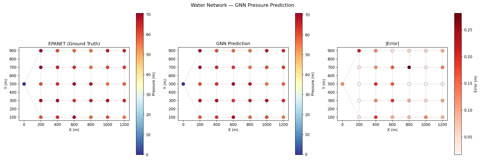
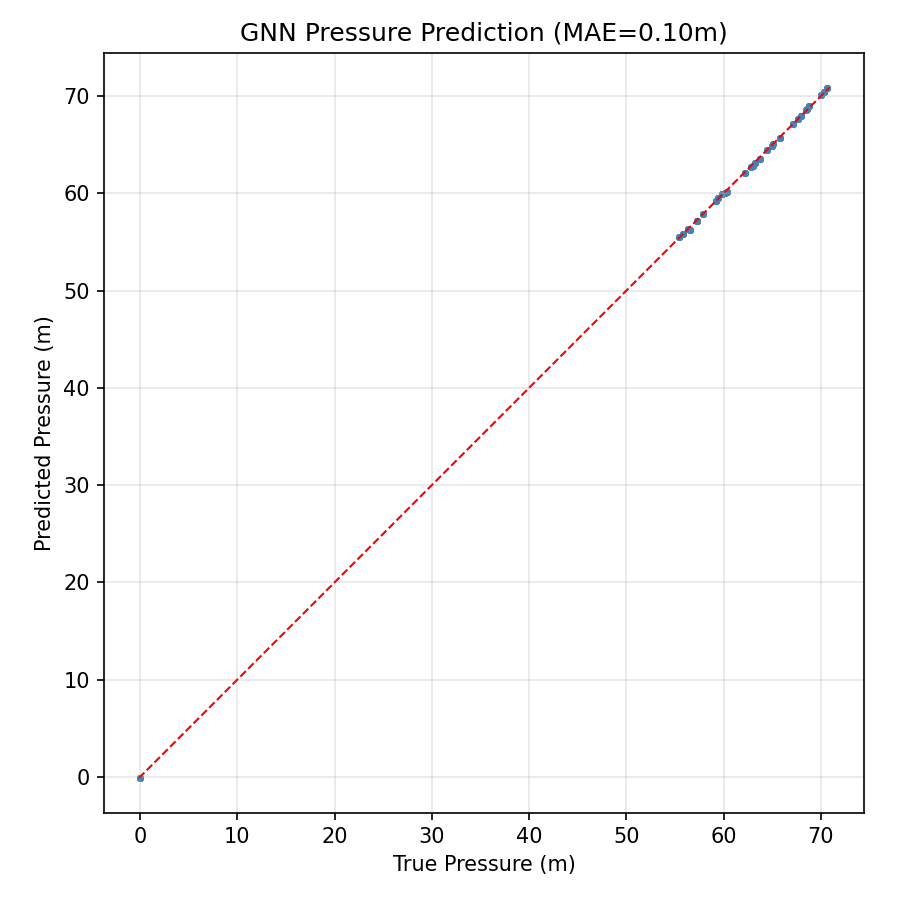

# Pipe Network Flow Optimizer (GNN)

Graph Neural Network that predicts nodal pressures in a water distribution network from the graph topology and demand patterns. Trained on 800 hydraulic scenarios generated by WNTR, achieving MAE of 0.10 meters (~0.16% relative error).

## Results

| Metric | Value |
|--------|-------|
| Test MAE | 0.10 m |
| Mean pressure | 61.0 m |
| Relative error | ~0.16% |
| Max node error (sample) | 0.28 m |
| Model parameters | 628,225 |
| Training scenarios | 560 (70% of 800) |


*Left: EPANET ground truth. Center: GNN prediction. Right: absolute error. The GNN accurately reproduces the spatial pressure distribution.*


*Predicted vs true pressure across all test nodes — tight diagonal indicates excellent accuracy*

## Approach

1. **Network model** — 5×6 grid water network: 30 junctions, 51 pipes, 1 reservoir (80m fixed head), 2 supply mains
2. **Data generation** — WNTR hydraulic simulator solves for pressures under 800 random demand scenarios (junction demands scaled 0.3x-2.0x)
3. **GNN architecture** — MeshGraphNet-style with 6 message-passing layers, residual connections, and LayerNorm

### Why GNN?

Water networks have inherent graph structure — pressure propagates along pipes (edges) between junctions (nodes). The GNN's message-passing architecture naturally encodes this connectivity, making it far more data-efficient than an MLP that would need to learn the topology from scratch. This approach extends directly to gas networks, district heating, and electrical grids.

### GNN Architecture Detail

```
Node features (6d): elevation, base_demand, base_head, is_junction, is_reservoir, demand_multiplier
Edge features (3d): pipe_length, diameter, roughness

Input → Node Encoder MLP (6→128) → Edge Encoder MLP (3→128)
     → 6× EdgeConv Layer [message(x_i||x_j||edge) → aggregate → update + residual + LayerNorm]
     → Decoder MLP (128→1) → Pressure per node
```

## Project Structure

```
src/
  data/generator.py       # Grid network builder + WNTR scenario generator
  models/gnn.py            # WaterNetworkGNN (EdgeConvLayer, SpectralConv)
train.py                   # End-to-end training pipeline + benchmarks
outputs/
  figures/                 # Network pressure maps, scatter, loss curves
  models/                  # Trained GNN checkpoint, results JSON
```

## Quick Start

```bash
pip install -r requirements.txt
python train.py
```

## Tech Stack

- **PyTorch Geometric** — GNN message-passing framework
- **WNTR** — US EPA's water network simulator (training data generation)
- **Matplotlib** — network visualization with color-coded pressures

## Part of the Physical AI Portfolio

This is Project 5 of a 7-project portfolio proving physics-informed AI skills across thermal systems, energy, structural mechanics, HVAC, pipe networks, rotating machinery, and CFD.
